# File generation and downloading example

The goal of this repository is to demonstrate how to create a system where a file is generated based on user-entered information without blocking the user just after form submission until a file is generated.

## Background story


Here is what the story looks like:
1. The user enters some information
2. The server starts generating a file based on that information asynchronously.
3. The user can click a link to download the file.

We want the user to have a pleasant experience, so we don’t want to block the form submission until the file is created.
To provide that nice experience, when the form is submitted, the information is stored, an asynchronous process is started for file generation, and the user is redirected to a confirmation page containing a download link.

If we’re lucky, the file was created by the time the user gets to the confirmation page, and we can show a download link pointing directly to it.
But what if the file was not created yet?
We still want to display the confirmation page as soon as possible. **The first trick is that we actually don’t need the file until the user clicks on the download link.**
Not needing the file until the user requests the download gives us some extra time to generate it in the background.

“That’s great, you may say, but we still need a URL to download the file. How can we know the file URL if the file hasn’t been generated?”
This is a good question, and the answer is to use a second trick: **You don’t need the file URL; you need a promise to be able to get that URL at some point.**
You need a way to ask the server if the file is available and how to get it when it’s ready.

This repository aims to show how to implement that, evolving the solution from a super simple solution with pure HTML pages to a click-to-download link with a spinner.
Seeing the iterations from the first to the final one helps to understand the pattern to solve that problem.

## Installation and run

The demo is a node application using the express framework.

Everything should be properly installed with:
```bash
npm install
```

Run the application with:
```bash
node index.js
```

## Using the demo app

### You are the worker

**⚠️ The background process is faked; you need to manually create the file.**
Because implementing an asynchronous job is not in the scope of this demo, there is no worker.
To make things convenient, this repo includes two commands to create and delete the file.
Said differently, you are the worker.
This gives you the advantage of experimenting at each step and observing the behavior of each click when the file is there or not.
You decide.

To create the file, run:

```bash
npm run create-receipt
```

To remove the file, run:

```bash
npm run clean-receipt
```

### There is no form

Because there is no worker, there is no need to trigger the worker, which allows us to skip building the form.
The confirmation page is the first page, served at the ‘/’ route.
In a real application, you are expected to see this page right after submitting the form.
It displays a link to download a file.

## Iterations

I’ve created this demo iterating on the code, starting with the simplest solution.
The cool thing is that it demonstrates how the solution works without JS.
Even better, because it was built gradually, it continues working even if the user browser deactivates JS.
JS is only there to improve the UX, but the application is still functional without it.

You can see the code for each iteration with a checkout of the correct tag.
I’ve provided a list of things you can experiment with to see how the system behaves for each iteration.
To get things more interesting, look at the network tab of your browser development tools.

I’ve also included some aside discussions because, yeah, why not?

To come back to the readme, run :

```bash
git checkout main
```

### Iteration 1: User polling

```bash
git checkout human-polling
```

or [view on Github](https://github.com/SelrahcD/file-generation-experiment/blob/human-polling/index.js)

**This iteration is super raw but really helps understand how this works as it requires the user to manually ask (and ask again, if needed) for the file.**
Future iterations are just UX improvements on top of it.

```mermaid
sequenceDiagram
actor User
participant confirmation_page as Confirmation page
participant waiting_page as Waiting page
participant receipt_controller as Receipt controller
participant file_download_controller as File download controller
confirmation_page-->>User: 👁️ Display "Download the file" link
User->>receipt_controller: 👇 Click on "Download the file" [GET]
loop
    alt File doesn't exist
        receipt_controller-->>waiting_page: returns
        waiting_page-->>User: 👁️ Display "Wait a few seconds and click that link to get the file"
        User->>receipt_controller: 👇 Click the link [GET]
    else File exists
        receipt_controller->>file_download_controller: Redirects to [with Location header]
        file_download_controller-->>User : 📄 File
    end
end
```



The confirmation page now displays a download link to the `/receipt` route.
The `/receipt` route controller acts as a traffic cop.
If the file is available, it will redirect to the real file download URL.
Otherwise, it returns a page explaining that the file is still being created and asking the user to wait a few seconds before clicking on a link to download it.

How can we deal with the file not being available when the user clicks on that second link?
The solution is to repeat that same process and show a page asking to wait and a link to download the file.
We already have a route that behaves this way, the `receipt` one.
Here the solution is that the link on the waiting page is a link to the waiting page.
Users are manully polling to see if the file is available when they click on the link.

**🧪 Experiment:**
- Create the file and click on the link on the confirmation page
- Create the file once you are on the waiting page and click the link
- Go to the waiting page, click the link, create the file, and click the link again

#### Why redirect and not send the file immediately from the receipt route?

You might think that the redirection overcomplicates the flow, and you want to send the file directly from the receipt route.
Sure, it saves from creating a new route and removes one HTTP request, but you should probably keep that as it is.

First, the file can be stored elsewhere, on a file storage like AWS S3.
In that case, you don’t want the file to pass through your server and want the file storage to serve it.
A redirection makes a lot of sense here.

Second, using the same URL for the traffic cop and serving the file will make caching harder.
Having a dedicated URL for the file will help the caching mechanisms detect that they can avoid fetching the file from the server again and again.


### Iteration 2: Blinking polling

```bash
git checkout blinking-polling
```

or [view on Github](https://github.com/SelrahcD/file-generation-experiment/blob/blinking-polling/index.js#L41)

The next improvement introduced is to avoid the need for the user to click on the second link on the waiting page.

```mermaid
sequenceDiagram
    actor User
    participant confirmation_page as Confirmation page
    participant waiting_page as Waiting page
    participant receipt_controller as Receipt controller
    participant file_download_controller as File download controller
    confirmation_page-->>User: 👁️ Display "Download the file" link
    User->>receipt_controller: 👇 Click on "Download the file" [GET]
    loop
        alt File doesn't exist
            receipt_controller-->>waiting_page: returns
            waiting_page-->>User: 👁️ Display "Wait a few seconds and click that link to get the file"
            rect rgba(172, 226, 225, 0.4)
                activate waiting_page
                waiting_page->>waiting_page: ⏱️ Wait for the delay specified in refresh meta
                waiting_page->>receipt_controller: GET
                deactivate waiting_page
            end
        else File exists
            receipt_controller->>file_download_controller: Redirects to [with Location header]
            file_download_controller-->>User : 📄 File
        end
    end
```



The simplest solution is to reload the waiting page every N seconds, which is what the user was manually doing by clicking on the link.
Once the file is ready, the download starts.

This is achieved by using a meta tag to the header: 

```html
<meta http-equiv="refresh" content="5">
```

Still no JS.


#### 💡 An information for the HTTP client

One interesting thing to note with the introduction of that meta tag is that we start differentiating information for the client and the user.
The meta tags is for the browser, the HTTP client, which knows how to interpret it.
The text is for the user, who knows how to interpret that as well.
The two pieces of information don’t have to match.

**🧪 Experiment:**
- Go to the waiting page and wait until the page reloads, then create the file

### Iteration 3: Polling without blinking

```bash
git checkout server-retry-after
```

or [view on Github](https://github.com/SelrahcD/file-generation-experiment/blob/cc758cd7d5096bff552ac23925d7be0b8e979d52/index.js#L48-L115)

The next improvement is to poll the server to see if the file has been created without reloading the page.
Now is the time for JS to come into play.

```mermaid
sequenceDiagram
    actor User
    participant confirmation_page as Confirmation page
    participant waiting_page as Waiting page
    participant receipt_controller as Receipt controller
    participant file_download_controller as File download controller
    confirmation_page-->>User: 👁️ Display "Download the file" link
    User->>receipt_controller: 👇 Click on "Download the file" [GET]

    alt File doesn't exist
        receipt_controller-->>waiting_page: returns
        waiting_page-->>User: 👁️ Display "Wait a few seconds and click that link to get the file"
        rect rgba(172, 226, 225, 0.4)
            activate waiting_page
            loop
                waiting_page->>receipt_controller: GET
                alt File doesn't exist
                    receipt_controller-->>waiting_page: Retry-After
                    waiting_page->>waiting_page: ⏱️ Wait for the delay specified in Retry-After
                else File exists
                    receipt_controller-->>waiting_page: Content-Disposition: Attachment Location:/download
                    waiting_page->>file_download_controller: GET
                    file_download_controller-->>waiting_page :  📄 File
                    waiting_page-->>User: 📄 File
                end
            end
            deactivate waiting_page
        end
    else File exists
        receipt_controller->>file_download_controller: Redirects to [with Location header]
        file_download_controller-->>User : 📄 File
    end
```



Once the waiting page is displayed, it starts polling the server to get information about the file.
It keeps polling the same route as before using JS `fetch` function. We are moving from a space where the browser is the HTTP client to a world where we are creating our own client.

Until the file is ready, a `Retry-after` header is added to the response.
It indicates to the client how long it should wait before asking again if the file is ready.
This is the information for the HTTP client.
The JS code interprets that header and retries after the delay proposed by the server.

Once the file is ready, the waiting route will issue a redirect to the file’s location.
The `fetch` function follows the redirection and gets a response containing `Content-Disposition: attachment;` header.
This is the trigger for doing some JS vaudoo to download the file.
That’s sad because we need to use some clever tricks to emulate something that was working natively until that point when the browser was the HTTP client.

**👋 Is there a less hacky way to start the download ?**

Hi, JS folks. Is there a better way to start the download of a file when the request is made via `fetch`?
This is one of the solutions I found online, but I feel like it should be more straightforward.

**🧪 Experiment:**
- Go to the waiting page, wait a little, then create the file

#### 💡 Why not hard-code the retry delay?
The server provides the delay for each retry using the `Retry-After` header.
An alternative could be to hardcode the delay in the client.
Using a header provided by the server adds some interesting possibilities, though.
First, it’s our mechanism to tell the client that it still needs to wait.
Without that we would need another way to communicate that information.
Alternatively, we could have a longer hardcoded delay, but that would mean potentially asking the user to wait longer than necessary.

Secondly, because the server can communicate how long the client should retry, it can change that waiting time.
Maybe the server can predict how long it will take until the file is ready and ask the client to wait just that long.
Or the server is serving many requests at the moment and would like every client to slow down with the amount of requests they send.
In that case, it can increase the delay, using that tool as a back pressure mechanism.


### Iteration 4: Clean and get a clever HTTP client

```bash
git checkout clean-fetch-decorator
```

or [view on Github](https://github.com/SelrahcD/file-generation-experiment/blob/clean-fetch-decorator/index.js#L50-L99)

This iteration doesn’t bring any functional improvements, but cleans the code by bringing some functional composition.

The JS code is refactored to have specific functions that are able to interpret an HTTP response and act accordingly.

`fetchWithRetryAfter` looks for a `Retry-After` header contained in a HTTP response and performs the retry logic.
`fetchDownloadAttachment` looks for an attachment and does the download trick.

You can create a clever HTTP client by combining all functions and reusing that for all your HTTP requests:

```js
const cleverFetch =  (fetchParams) =>  fetchWithRetryAfter(() => fetchDownloadAttachment(fetch(fetchParams)))
```

The HTTP response handling logic is now contained in one place, and these functions can be tested independently.


### Iteration 5: Spinner

```bash
git checkout spinner
```

or [view on Github](https://github.com/SelrahcD/file-generation-experiment/blob/spinner/index.js#L9-L115)

Let’s now move to the modern world of SPA.
In a SPA, you probably wouldn’t want the user to move from the confirmation page to the waiting page if the file isn’t ready but displays a spinner.

This is what this iteration is about. We want to stay on the confirmation page and avoid moving to the waiting page, even if the file is not there.

```mermaid
sequenceDiagram
actor User
participant confirmation_page as Confirmation page
participant waiting_page as Waiting page
participant receipt_controller as Receipt controller
participant file_download_controller as File download controller
confirmation_page-->>User: 👁️ Display "Download the file" link
rect rgba(172, 226, 225, 0.4)
User->>confirmation_page: 👇 Click on "Download the file" [GET]
activate confirmation_page
confirmation_page->>confirmation_page: 🔄 Display spinner
confirmation_page->>receipt_controller: GET
loop
    alt File doesn't exist
        receipt_controller-->>confirmation_page: Retry-After
        confirmation_page->>confirmation_page: ⏱️ Wait for the delay specified in Retry-After
        confirmation_page->>receipt_controller: GET
    else File exists
        receipt_controller-->>waiting_page: Content-Disposition: Attachment Location:/download
        confirmation_page->>file_download_controller: GET
        file_download_controller-->>confirmation_page :  📄 File
        confirmation_page-->>User: 📄 File
    end
end
confirmation_page->>confirmation_page: Hide spinner
end
```



For this, we attach an event listener to the link, prevent it from moving to the next page, display a spinner, and start polling the `receipt` route.
We keep the same logic as before and mostly the same JS code.
If the response contains a `Retry-After` header, the file is not there yet, and a future request is scheduled.
If the response contains a `Content-Disposition: attachment;` header, we do the JS download trick and hide the spinner.

Also, the URL used for polling is the one specified in the `href` attribute of the link.
We didn’t need to change that template part to make it work.
Even better, it means that if JS is disabled, the default behavior will take over from our code and will issue a request to `/receipt`, which will display the waiting page or redirect to the file, depending on the file’s existence.
That’s progressive enhancement.

**🧪Experiment:**
- On the confirmation page, click on the link, see the spinner and create the file
- On the confirmation page, create the file, then click on the link
- On the confirmation page, click on the link, and do nothing. (I agree, I should have included an error message here.)
- Disable JS, and try whatever you want to.

### Iteration 6: Cleaning

```bash
git checkout main
```

The next iteration is cleaning the code, reducing page duplication, using a templating system.

**👋 I couldn’t do something here, and maybe you can help me:**
I want to use two regions in the layout, `body` and `scripts`.
The idea is that every page template is able to provide its content and its own script.
At the moment, the script is pushed right into the `<body>`.
It works, but I’m curious how to do that with Handlebars and ExpressJs.
I actually spent more time on this issue than on the rest of that demo...


## Alternatives

Instead of polling to get the status of the file creation, you could use sockets to push the information to the client.
If you’re working in a server-to-server mode, you could also use a webhook mechanism to notify the other server that the file is ready. 

## Resources

[📺 Avoiding long running HTTP API requests. - Code Opinion](https://www.youtube.com/watch?v=2yUnY61zdAk)
